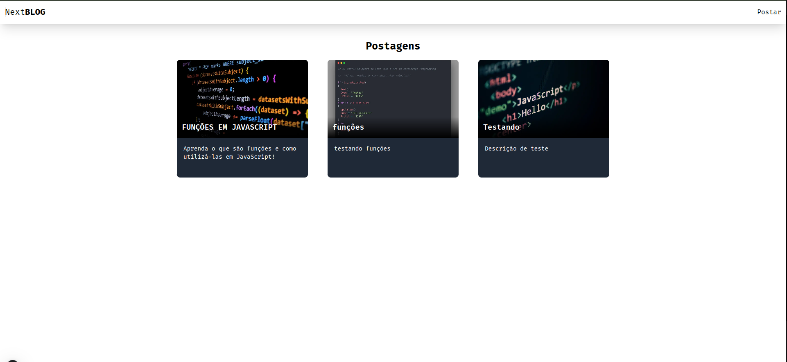
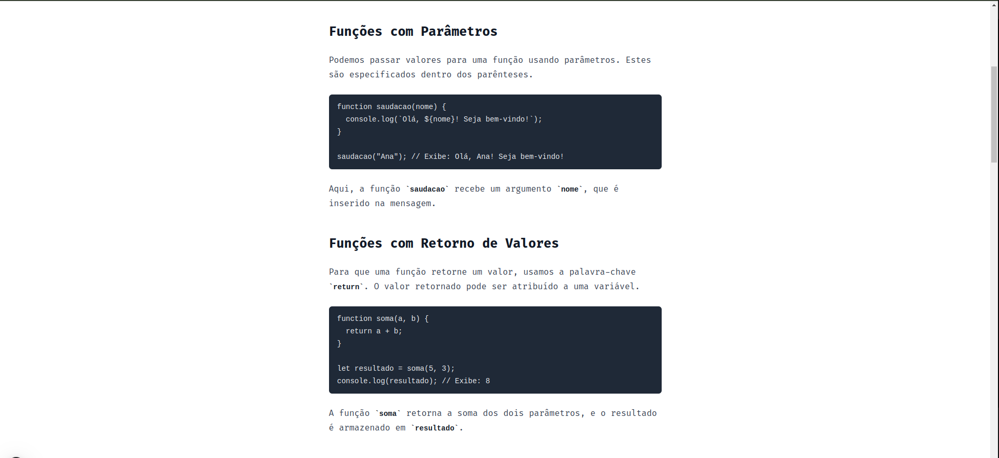
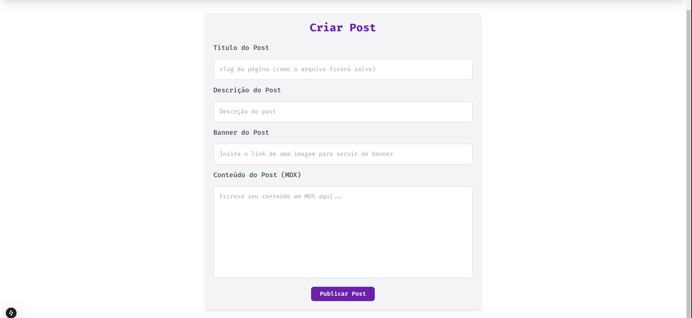

# **NextBLOG**

NextBLOG é uma aplicação de blogs que permite a criação de postagens em formato Markdown sem necessidade de um banco de dados. Todas as operações de criação e gestão de postagens são realizadas diretamente no sistema de arquivos do Node.js, utilizando `file-system`.

## ✨ Funcionalidades

- **Criação de postagens** em Markdown, com suporte para formatação personalizada.
- **Listagem de postagens** na página principal.
- **Visualização individual de cada postagem** com uma interface amigável.
- Sistema de gerenciamento de arquivos para **armazenamento de conteúdo** sem banco de dados.

---

## 🚀 Tecnologias Utilizadas

<div align="center">
    <code></code>
    <code></code>
    <code></code>
    <code></code>
</div>

---

## 🖼️ Imagens da Aplicação


<p align="center">Página Inicial com listagem de postagens</p>


<p align="center">Página de exibição individual de uma postagem</p>


<p align="center">Página de criação de postagens com suporte a Markdown</p>

---

## ⚙️ Instalação e Configuração

### Pré-requisitos
- **Node.js** (>=14)
- **NPM** (ou **Yarn**, conforme preferir)

### Passos de Instalação

1. **Clone o Repositório**:
   ```bash
   git clone https://github.com/kaid3v/next-blog.git
   cd next-blog
   ```

2. **Instale as Dependências**:
   ```bash
   npm install
   # ou
   yarn install
   ```

3. **Execute o Servidor de Desenvolvimento**:
   ```bash
   npm run dev
   # ou
   yarn dev
   ```

4. **Acesse a Aplicação**:
   Abra o navegador e vá para `http://localhost:3000`.

---

## 📜 Estrutura do Projeto

- **/src/app**: Contém os componentes principais e páginas.
- **/src/markdown**: Diretório onde os arquivos Markdown das postagens são armazenados.
- **/public/assets**: Armazena imagens e recursos estáticos.

---

## 📝 Como Criar uma Nova Postagem

1. Vá para a **página de criação de blogs**.
2. Preencha o formulário com os seguintes campos:
   - **Título**: Título da postagem.
   - **Descrição**: Descrição breve para a listagem.
   - **Banner**: URL de imagem para banner.
   - **Conteúdo**: Conteúdo em Markdown.

3. Clique em **Publicar** e a postagem será automaticamente salva no diretório `/src/markdown`.

---

## 📂 Estrutura de Arquivo Markdown

Cada postagem é armazenada no formato `.mdx` e inclui metadados no cabeçalho do arquivo. Um exemplo de estrutura de arquivo Markdown:

```markdown
---
title: Meu Primeiro Blog
description: Uma breve descrição do blog.
banner: https://link-para-imagem-do-banner.jpg
---

# Introdução

Escreva o conteúdo da postagem aqui...
```

---

## 📚 Recursos de Estudo e Documentação

- [Documentação Next.js](https://nextjs.org/docs)
- [Markdown Guide](https://www.markdownguide.org/basic-syntax/)
- [Node.js File System (fs)](https://nodejs.org/api/fs.html)
- [Tailwind CSS Documentation](https://tailwindcss.com/docs/installation)
- [Remark Repository](https://github.com/remarkjs/remark)
- [Remark-Html Repository](https://github.com/remarkjs/remark-html)
- [Gray Matter Repository](https://github.com/jonschlinkert/gray-matter)

---

## 📄 Licença

Este projeto é licenciado sob a [MIT License](./LICENSE).

---

## 👨‍💻 Autor

Desenvolvido por [KaiD3v](https://github.com/kaid3v).

---